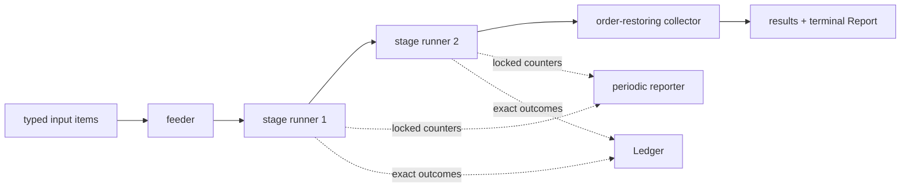

# Intern Guide to Live Flow Observation, Progress Aggregation, and Safe Event Delivery

## 1. Executive summary

Flowkit already knows almost everything an operator needs to understand a long run. A `StepReport` counts items, cache hits and misses, fresh work, retries, quarantines, skipped items, resource spend, and provider meters. A `Report` groups those counters by step. The runner updates the counters under locks while work is happening, and `logProgress` already reads those live reports every thirty seconds. Flowkit also has an exact per-item `Event` and a `Ledger` sink used for durable JSONL journals.

The missing feature is a supported, reusable way for an application to receive **periodic immutable report snapshots and lifecycle boundaries while the flow is still running**. Today the complete `Report` is returned only when `Run` exits; the periodic state is written only to logs; and the ledger vocabulary has outcomes such as `hit`, `stored`, `done`, `retry`, `quarantined`, and `skipped`, but no run/step lifecycle or timestamp.

This ticket adds a progress-reporting seam without creating a second execution engine and without putting UI concerns in Flowkit. The design keeps two different contracts explicit:

- **Ledger events are exact custody records.** If a configured ledger cannot record an event, the run fails rather than spending provider money without its promised journal.
- **Progress snapshots are immutable aggregate observations.** They are published at bounded intervals and phase boundaries. A consumer can persist them, graph them, or expose them over an API.

The immediate consumer is `rag-ttc index build`, but the API must remain product-neutral.

## 2. Start here: the execution model

A Flowkit `Step[I,O]` in `flow/step.go` contains:

- a stable cache `Identity`;
- a `Policy` controlling workers, resource admission, retry, and failure mode;
- the typed `Do` function;
- optional usage metering;
- an `OnResult` hook for successful values;
- optional custom execution used by `Bulk` and `Batched`.

`flow.Run` validates the complete pipeline and resource preflight before item one. `runStages` then connects one runner per stage with channels. The final collector restores input order even though workers complete out of order. This ordering guarantee is important to evaluation joins and must not change.



### 2.1 What is already observable

`flow/report.go` defines the canonical aggregate:

```go
type StepReport struct {
    Items, Hits, Misses, Stored, WorkCalls int
    StartedSequences, Retries              int
    Quarantined, Skipped                   int
    RetriesByClass map[string]int
    Spend          map[string]execution.BudgetSnapshot
    Meters         Meters
}

type Report struct {
    Steps map[string]StepReport
}
```

`typedRunner.report()` takes the runner mutex, copies the counters, copies meters, and obtains current resource-budget snapshots. `runStages` already calls this method from a periodic goroutine in `logProgress`. Therefore live report acquisition is proven and does not require exposing mutable runner internals.

`flow/report.go` also defines `Event` and `Ledger`:

```go
type Event struct {
    Step string; Index int; Type EventType
    Class string; Attempt int; Error string
}

type Ledger interface {
    Event(context.Context, Event) error
}
```

The runner emits events for cache hits, stored and uncached completions, retries, quarantines, and skips. Tests in `flow/run_test.go` and `flow/bulk_test.go` prove that ledger failures propagate and that terminal outcomes are journaled.

### 2.2 Why `OnResult` is not the progress API

`Step.OnResult` sees successful cache hits and fresh results. It deliberately does not see quarantined or skipped items, retry pressure, budget snapshots, or pipeline lifecycle. It is typed on `O`, making it suitable for streaming domain artifacts but unsuitable as a generic observability contract. Do not overload it.

## 3. Gap analysis

The current implementation has five gaps:

1. `Report` is public only at return time; applications cannot subscribe to live snapshots.
2. `logProgress` hardcodes a package-level thirty-second interval and emits only selected counters.
3. ledger events have no timestamp, run boundary, or step boundary.
4. there is no documented ordering contract for concurrently emitted ledger events.
5. custom engines (`Bulk`, `Batched`, pipeline overrides) must participate without double-counting nested work.

The gap is not “Flowkit has no events.” The gap is “the existing exact events and aggregates do not yet form a complete supported live-observation contract.”

## 4. Proposed public API

Add the following product-neutral types to `flow/report.go` or a focused `flow/observe.go`:

```go
type Snapshot struct {
    Sequence  uint64    `json:"sequence"`
    StartedAt time.Time `json:"started_at"`
    UpdatedAt time.Time `json:"updated_at"`
    Total     int       `json:"total"`
    Terminal  bool      `json:"terminal"`
    Report    Report    `json:"report"`
}

type Reporter interface {
    Report(context.Context, Snapshot) error
}

type ReporterFunc func(context.Context, Snapshot) error

func (f ReporterFunc) Report(ctx context.Context, s Snapshot) error {
    return f(ctx, s)
}
```

Extend `Options` with:

```go
type Options struct {
    // existing fields: Store, Preflight, Ledger, shared environment...
    Reporter       Reporter
    ReportInterval time.Duration
    Clock          func() time.Time // test seam; nil means time.Now
}
```

The default interval remains thirty seconds for library callers. Product callers such as an interactive job supervisor may select two seconds. A non-positive interval disables periodic snapshots but still emits initial and terminal snapshots when a reporter is present.

### 4.1 Snapshot immutability

A snapshot must deep-copy maps. Copying the `Report` struct alone aliases:

- `Report.Steps`;
- `RetriesByClass`;
- `Spend`;
- `Meters`.

Add:

```go
func (r Report) Clone() Report
func (s StepReport) Clone() StepReport
```

The reporter must never observe maps that runners later mutate.

### 4.2 Lifecycle events

Extend `EventType` with lifecycle events:

```go
EventRunStarted    = "run_started"
EventStepStarted   = "step_started"
EventStepCompleted = "step_completed"
EventRunCompleted  = "run_completed"
EventRunFailed     = "run_failed"
```

Add `At time.Time` and optional `Total` to `Event`. The ledger implementation, not worker completion order, owns durable sequence assignment. Flowkit promises that each call to one ledger instance is serialized; it does not claim item-index ordering because workers complete concurrently.

A minimal contract is:

- one `run_started` after validation and preflight, before work;
- one `step_started` before a stage accepts its first clean item;
- one `step_completed` after the stage drains successfully;
- exactly one `run_completed` or `run_failed`;
- outcome events occur between their step boundaries.

## 5. Runtime wiring

Replace the logging-only goroutine with one publisher that logs and reports from the same snapshot.

```text
func publishProgress(ctx, stop, total, runners, options):
    started = clock()
    sequence = 0

    emit(terminal=false)
    if interval <= 0:
        wait for stop
        return

    every interval:
        report = merge(runner.report() for runner in runners)
        snapshot = deepClone(report)
        sequence++
        log(snapshot)
        options.Reporter.Report(ctx, snapshot)

runStages(...):
    validate and build runners
    create reporter context independent from worker cancellation long enough
        to publish the terminal snapshot
    execute feeder, stages, collector under errgroup
    merge terminal report
    publish terminal snapshot with context.WithoutCancel(ctx)
    return results, report, error
```

The final snapshot must be attempted after worker cancellation, using a bounded `context.WithoutCancel(ctx)` child, because the caller needs the terminal state even when the run was canceled. The implementation must not hang indefinitely: use a short configurable or fixed timeout around sink delivery.

## 6. Error, backpressure, and security semantics

### Decision: progress reporter failures fail the run

- **Context:** A long provider-backed operation may cost substantial money. Advertising durable progress while silently dropping it produces an untrustworthy run record.
- **Options considered:** best-effort reporter; asynchronous lossy channel; synchronous fail-closed reporter.
- **Decision:** Reporter errors fail the run when a reporter is configured. Applications wanting best-effort telemetry can wrap their reporter and return nil.
- **Rationale:** This matches the existing `Ledger` contract and keeps durability policy at the application boundary.
- **Consequences:** Reporter implementations must be fast and bounded. The RAG-TTC reporter will aggregate in memory and atomically write small files rather than perform network calls.
- **Status:** proposed.

### Decision: snapshots are sampled; exact outcomes remain ledger events

- **Context:** A progress graph needs bounded samples, while retries and terminal failures need exact records.
- **Options considered:** persist every counter mutation; periodically sample only; combine exact events with sampled aggregates.
- **Decision:** Keep exact `Ledger` events and add sampled `Reporter` snapshots.
- **Rationale:** A 17,749-item build remains affordable, and a reconnecting UI receives both history and diagnosis.
- **Consequences:** A sample can skip short-lived rates, but final totals remain exact and failures remain individually recorded.
- **Status:** proposed.

### Decision: do not include domain inputs or outputs

Snapshots and events carry indexes, classes, counters, and error messages—not prompts, source text, answers, embeddings, or provider payloads. Domain artifacts remain the consumer's responsibility. This prevents a generic observability API from becoming a data-exfiltration path.

## 7. Pipeline, Bulk, and Batched behavior

The implementation must preserve these invariants:

- Pipeline reports remain keyed by flattened stage name.
- A flagged item bypassing later stages does not increment later-stage work.
- `Batched` repair work remains attributed to its nested repair step.
- `Bulk` counts provider batches and per-item outcomes exactly as its terminal report does today.
- Cache hits are free and remain unmetered.
- retry attempts consume admission exactly as before.

Do not emit snapshots independently from nested calls to `Run` and then merge them as if they shared one clock. The top-level execution should provide one reporter environment through shared `Options`; nested engines contribute their canonical report to the outer stage. Tests must catch duplicate counts.

## 8. Implementation phases

### Phase 1 — Immutable report cloning

Files:

- `flow/report.go`
- `flow/report_test.go` (new if useful)

Implement and test deep cloning, including mutation-after-clone tests for every map.

### Phase 2 — Reporter options and periodic publisher

Files:

- `flow/run.go`
- `flow/observe.go` (new)
- `flow/run_test.go`

Replace `logProgress` with a publisher driven by `Options`. Preserve existing log lines when no reporter is configured.

### Phase 3 — Lifecycle ledger events

Files:

- `flow/report.go`
- `flow/run.go`
- `flow/bulk.go`
- tests for event ordering and exactly-once terminal events.

### Phase 4 — Composition parity

Run focused tests over:

- scalar `Run`;
- `Bulk`;
- `Batched` including repair;
- `Pipe2`/`Pipe3`;
- cache-only replay;
- quarantine and fail-fast;
- cancellation and reporter failure.

### Phase 5 — Documentation and release

Update `flow/doc.go` and examples with a file-backed reporter example. Release a new Flowkit version before RAG-TTC consumes the API.

## 9. Test strategy

Required tests include:

1. initial and terminal snapshots for an empty input set;
2. monotonically increasing snapshot sequence and timestamps;
3. terminal report byte-equivalent to `Run`'s returned report;
4. no aliasing after snapshot publication;
5. reporter error stops new work and returns a named error;
6. cancellation still attempts a terminal snapshot;
7. concurrent workers produce race-free snapshots (`go test -race ./flow`);
8. cache hits, retries, quarantines, skips, meters, and spend match terminal counters;
9. pipeline and nested `Batched` reports do not double count;
10. no reporter preserves current behavior and performance envelope.

Validation commands:

```bash
go test ./flow ./execution -count=1
go test -race ./flow -count=1
go test ./... -count=1
go vet ./...
```

## 10. Alternatives rejected

- **Parse logs.** Logs are prose, sampled, incomplete, and not an API.
- **Have RAG-TTC inspect private runner state.** This couples a product to Flowkit internals.
- **Use only `OnResult`.** It omits failures, retries, spend, and lifecycle.
- **Persist every provider payload in Flowkit.** That violates package ownership and sensitivity boundaries.
- **Rewrite Flowkit around a job scheduler.** Scheduling belongs to consumers; this ticket observes execution only.

## 11. Open questions

1. Should lifecycle events be added to `Ledger`, or should snapshots alone carry run boundaries? The recommendation is lifecycle events because exact journals need terminal reason.
2. Should reporter timeout be an `Options` field or a documented constant? Start with a constant unless a real consumer needs tuning.
3. Should timestamps come from Flowkit's injected clock or be assigned by the sink? Flowkit should assign event time; the sink assigns durable sequence.
4. Is `Error` safe to persist verbatim? Flowkit should document that callers must classify/redact provider errors before returning them when secrets are possible.

## 12. File reference map

- `flow/step.go` — typed step, meter hooks, `OnResult`, custom engine seam.
- `flow/policy.go` — worker, retry, admission, and failure-mode semantics.
- `flow/report.go` — canonical `StepReport`, `Report`, `Event`, and `Ledger` contracts.
- `flow/run.go` — pipeline runner, locked live reports, current `logProgress`, event emission.
- `flow/bulk.go` — provider-batch override and bulk retry/outcome accounting.
- `flow/batch.go` — grouped generation plus per-item repair composition.
- `flow/pipe.go` — flattened streaming pipeline construction.
- `flow/run_test.go` — retry, budget, meter, ledger, and failure-mode invariants.
- `flow/bulk_test.go` — bulk parity, ledger outcomes, and streaming hooks.
- `execution/budget.go` and `execution/resource_plan.go` — spend snapshots and fail-closed admission.

## 13. Definition of done

FLOWKIT-002 is complete when a consumer can configure a reporter, receive immutable periodic snapshots and exact lifecycle events across scalar, bulk, batched, and piped execution, prove terminal parity under race tests, and persist no domain payloads through the generic contract.
